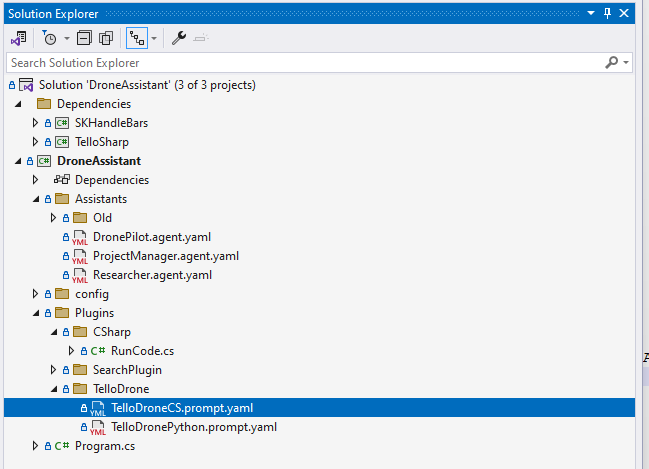
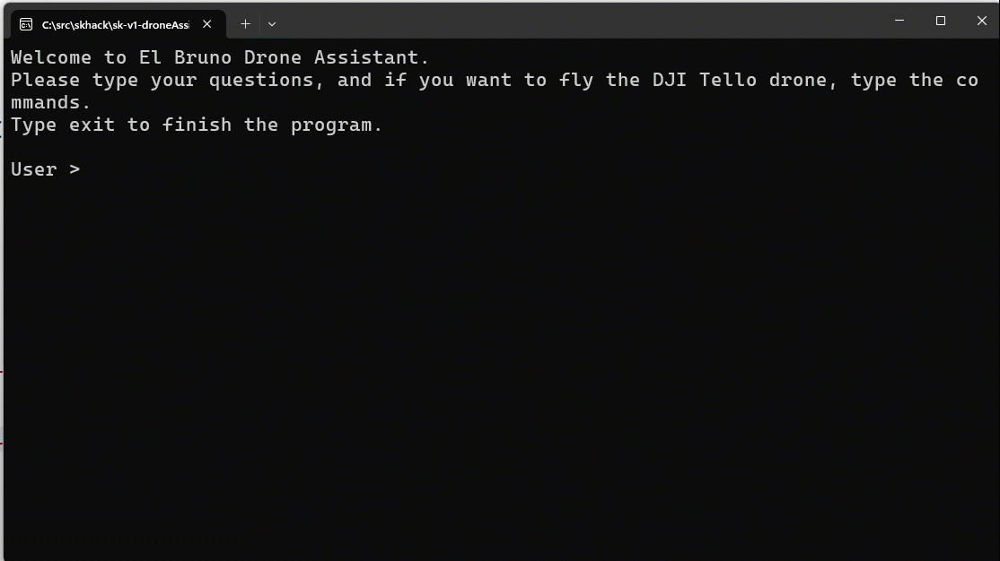

# Semantic Kernel V1 Assistant for DJI Tello Drone Control 🚀

## 🌟 General Description
In this project, my goal was to master the new Assistant features in Semantic Kernel V1. The main application of this project draws inspiration from Matthew Bolanos's work, which you can explore [here](https://github.com/matthewbolanos/sk-v1-proposal/tree/main/dotnet/samples/06-Assistants).

## 💡 The Idea
The concept is to create an assistant capable of controlling a DJI Tello Drone through typed natural language commands. This assistant utilizes two primary skills:
1. **Code Generation**: Generating C# code to fly the drone.
2. **Code Execution**: Running the generated C# code to execute the flight plan.

The assistant can both craft and implement a flight plan in C#. For clarity, an Assistant YAML Sample definition is included in the project. Additionally, here's an animation illustrating the process:


## 🛠️ Plugins
The project explores two types of plugins:
1. **Tello Drone Plugin**: A prompt-based plugin using a template to create drone-compatible C# code.
    - General content of the template:
      ```markdown
      // code sample
      ```

2. **C# CodeRun Plugin**: This is a C# code-based plugin that employs Roslyn to execute C# code. It uses "Microsoft.CodeAnalysis.CSharp" and "Microsoft.CodeAnalysis.CSharp.Scripting" nuget packages.
    - Key code for running C# code:
      ```csharp
      // code sample
      ```

Here's the current project structure, including the assistant and plugins:



## 📝 Sample Generated Code
Examples of inputs and generated C# code:

- Input: "Send the drone the following actions: takeoff, bounce and land"
  - Generated C# Code:
    ```csharp
    using TelloSharp;

    Tello tello = new();
    tello.Connect();

    Console.WriteLine("Start Connection");
    int i = 0;
    while (tello._connectionState != Tello.ConnectionState.Connected)
    {
        Console.WriteLine("Connecting ... " + i);
        System.Threading.Thread.Sleep(1000);
        i++;        
        if (i == 5)
            break;
    }

    Console.WriteLine("Connected. Battery Level " + tello.State.BatteryPercentage);

    // take off the drone
    tello.TakeOff();
    Console.WriteLine("Take Off");

    // sleep of 5 seconds
    System.Threading.Thread.Sleep(5000);

    // tello drone bounce
    tello.Bounce();
    Console.WriteLine("Bounce");

    // land the drone
    tello.Land();
    Console.WriteLine("Land");
    ```

- Input: "Search on how can we program and control the DJI Tello drone using C#?"

  

## 📚 Notes
I tested the Assistants and plugins with two GPT models: `gpt-4-1106-preview` and `gpt-3.5-turbo-1106`. Here's a C# snippet for the models:
```csharp
// GPT models
//IChatCompletion gpt = new OpenAIChatCompletion("gpt-4-1106-preview", OpenAIApiKey);
IChatCompletion gpt = new OpenAIChatCompletion("gpt-3.5-turbo-1106", OpenAIApiKey);
```
Both models performed well, with `gpt-3.5-turbo-1106` being faster and more economical.

The Researcher Assistant and Search Plugin remain in the project for demonstration. The Project Manager utilizes these tools to interact with the user:
```csharp
// Project Manager and Drone Pilot Assistant code
// ---------------------------------------------------
// DRONE PILOT Assistant
// ---------------------------------------------------
// Create a drone pilot assistant
IPlugin dronePilot = AssistantKernel.FromConfiguration(
	currentDirectory + "/Assistants/DronePilot.agent.yaml",
	aiServices: new() { gpt },
	plugins: new() { openAIChatCompletionDrone, csharpCodeManagerPlugin }
);
// Create a Project Manager
AssistantKernel projectManager = AssistantKernel.FromConfiguration(
	currentDirectory + "/Assistants/ProjectManager.agent.yaml",
	aiServices: new() { gpt },
	plugins: new() { researcher, dronePilot }
);
```

Also, I prepared a set of demo user inputs for demonstration purposes:
```csharp
// Sample user input for demo
switch (userInput.ToLower())
{
    case "d1":
        userInput = "send the drone the following actions: takeoff the drone, move forward 25 centimeters and land";
        break;
    case "d2":
        userInput = "send the drone the following actions: takeoff, bounce and land";
        break;
    default:
        break;
}
```

## 🚁 Drone Experience
I have been doing demos with C# and Python using a DJI Tello drone for several years. You can find resources about my experience [here](http://aka.ms/elbrunodrones). For this project, I used Tello Sharp, an open-source library, available [here](https://github.com/sblanchard/TelloSharp), rather than creating a drone SDK from scratch. Some notable experiences include:
- A talk during Azure Python Day, viewable [here](https://www.youtube.com/live/9xxpn-bJes0?si=p36G6hf4fEHNgSGz&t=18120).
- A presentation on "The .NET Docs Show - Let's code a drone

 to follow faces", available [here](https://www.youtube.com/watch?v=2xeKomASV0E&ab_channel=dotnet).

---

Eager to share this project with the hackathon community and looking forward to your feedback and collaboration! Let's explore new horizons together! 🌍🚁