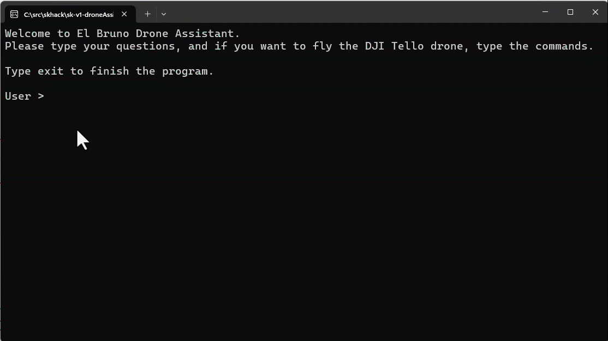

# Semantic Kernel V1 Assistant for DJI Tello Drone Control

## General Description

I embarked on this project with the goal to deeply understand and utilize the new Assistant features in Semantic Kernel V1. The foundation of my application is inspired by and based on the work of Matthew Bolanos, which you can explore [here](https://github.com/matthewbolanos/sk-v1-proposal/tree/main/dotnet/samples/06-Assistants).

### Idea

The core idea of this project is to develop an assistant that can command a DJI Tello Drone using natural language inputs. This assistant is equipped with two key skills: 

1. **Code Generation**: It can generate C# code necessary for drone flight based on typed commands.
2. **Code Execution**: It executes the generated C# code to carry out the flight plan.

This design enables the assistant to both create and implement a flight plan in C#. Additionally, I've included an Assistant YAML sample definition in our repository for further clarity. Below is an animation showcasing the working process:



### Plugins

In this project, I explored two types of plugins:

1. **Tello Drone Plugin**: A prompt-based plugin that uses a template to generate C# code. Tailored instructions within this template ensure the code is specifically designed to control the drone.
2. **C# CodeRun Plugin**: A code-based plugin that uses Roslyn to execute C# code snippets. To run the code, I incorporated nuget packages "Microsoft.CodeAnalysis.CSharp" and "Microsoft.CodeAnalysis.CSharp.Scripting".

Here's the current project structure, including the assistant `[DronePilot.agent.yaml]` and the two plugins `[TelloDroneCS.prompt.yaml]` and `[RunCode.cs]`:


### Notes

During my project, I tested the Assistants and plugins with two GPT models: `gpt-4-1106-preview` and `gpt-3.5-turbo-1106`. Here's a snippet of the C# code used for this:

```csharp
// GPT models
//IChatCompletion gpt = new OpenAIChatCompletion("gpt-4-1106-preview", OpenAIApiKey);
IChatCompletion gpt = new OpenAIChatCompletion("gpt-3.5-turbo-1106", OpenAIApiKey);
```

Both models performed well, but I found `gpt-3.5-turbo-1106` to be faster and more cost-effective.

I also retained the Researcher Assistant and Search Plugin in the project, mainly for demonstration purposes. The Project Manager plays a crucial role, using the Researcher and PilotDrone before interacting with the user. Here's a sample of the C# code used:

```csharp
// code sample
```

Furthermore, I included a set of demo user inputs for demonstration purposes:

```csharp
// code sample
```

### Drone Experience

I have several years of experience conducting demos using C# and Python with the DJI Tello drone. For more insights and resources on my experience, visit [http://aka.ms/elbrunodrones](http://aka.ms/elbrunodrones). In this demo, instead of developing a drone SDK from scratch, I chose to integrate the Tello Sharp open-source library, available [here](https://github.com/sblanchard/TelloSharp). For instance:

- I shared a similar experience during Azure Python Day, which can be viewed [here](https://www.youtube.com/live/9xxpn-bJes0?si=p36G6hf4fEHNgSGz&t=18120).
- I also presented in the .NET Show, "The .NET Docs Show - Let's code a drone to follow faces," available [here](https://www.youtube.com/watch?v=2xeKomASV0E&ab_channel=dotnet).

---

I am excited to share this project with the hackathon community and eagerly look forward to feedback and collaboration. Let's explore the possibilities together!